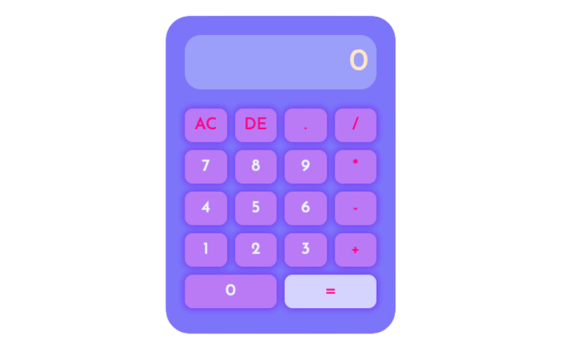

This is a simple calculator developed using HTML, CSS, and JavaScript. It allows performing basic mathematical operations such as addition, subtraction, multiplication, and division.

<<<<<<< HEAD

=======

>>>>>>> 4dded808b54a2cbebe392055efac66f2c64f95c9

## Demo ⤵

- https://sandovaljohana.github.io/calculatorproject3/

## ⭐ Features

- Intuitive user interface with virtual keys.
- Performs operations in real-time as the user enters data.
- Support for basic operations of addition, subtraction, multiplication, and division.
- Responsive design to adapt to different screen sizes.

## ⚙ How to Use 

1. Clone this repository or download the source code.
2. Open the `index.html` file in your web browser.
3. Use the virtual keys to input numbers and perform operations.
4. Watch the results update in real-time on the screen.

## ⚒ Technologies Used

<<<<<<< HEAD

  

=======
- HTML: Basic structure of the calculator.
- CSS: Styling and design of the user interface.
- JavaScript: Logic for performing mathematical operations.
>>>>>>> 4dded808b54a2cbebe392055efac66f2c64f95c9

## 🏗 Project Structure

- `index.html`: Main page containing the HTML structure of the calculator.
- `styles.css`: CSS file defining the style and design of the calculator.
- `script.js`: JavaScript file containing the logic for mathematical operations.
  

